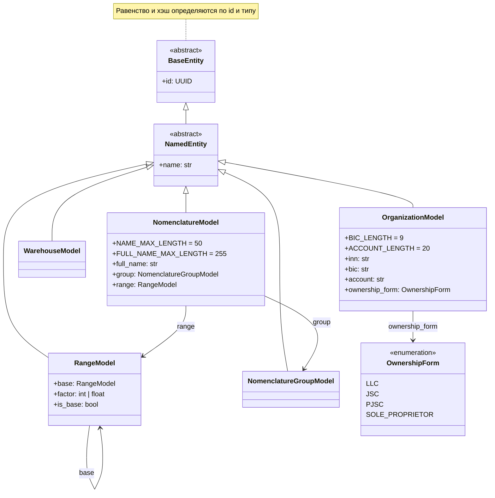
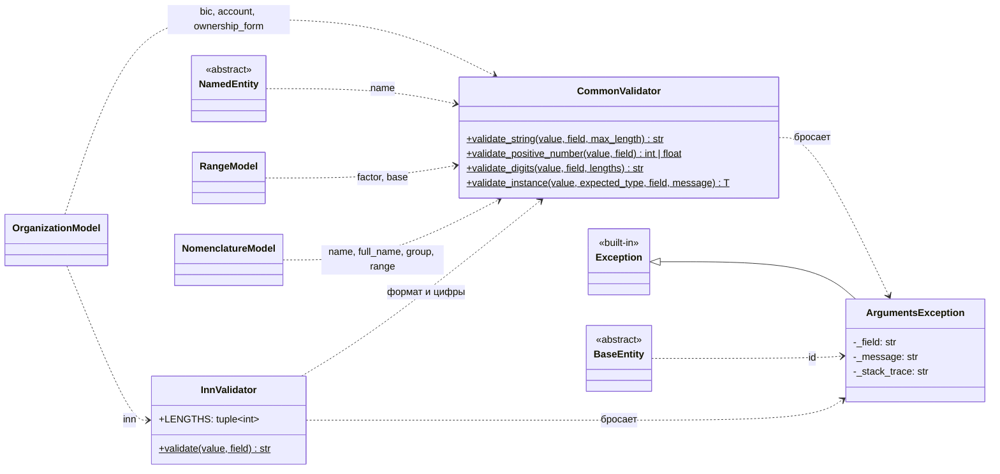

# Диаграммы классов

Диаграммы описывают реализованный код в `Src/`, а не планы из `Docs/DomainEntities.md`.
При добавлении, переименовании или удалении класса обновляйте соответствующую диаграмму.
Mermaid отображается в GitHub и в IDE с поддержкой Markdown.

## Модели

Все модели лежат в `Src/Models/`, базовые классы — в `Src/Core/`.
Стрелка с пустым треугольником — наследование, обычная стрелка — хранимая ссылка на другую модель.

## Проверки и ошибки

Все проверки бросают `ArgumentsException`. Модели вызывают валидаторы из сеттеров.

