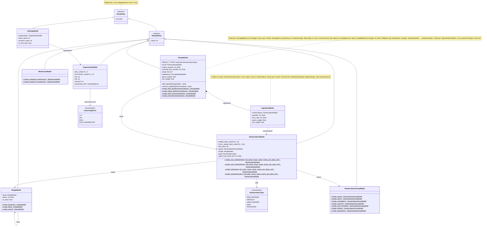
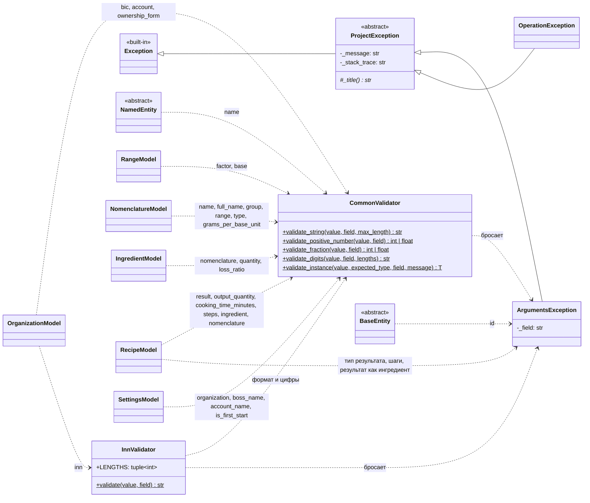
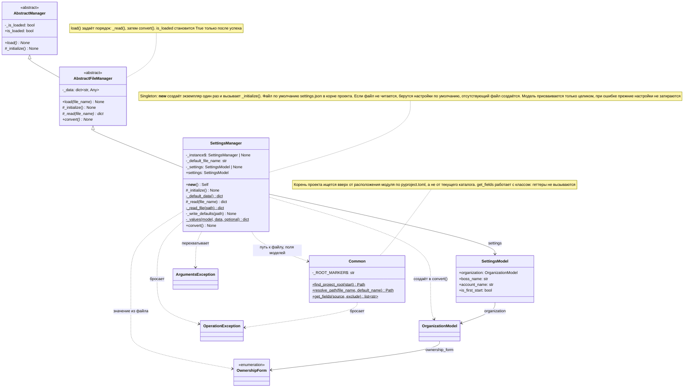
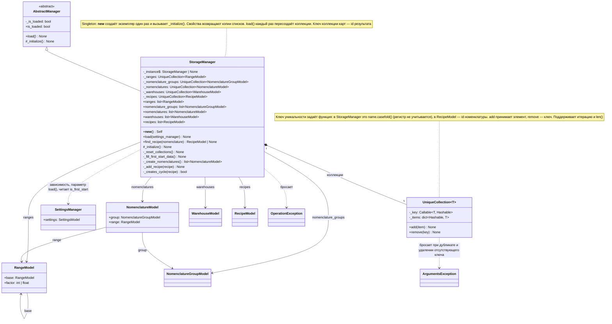

# Диаграммы классов

Диаграммы описывают реализованный код в `Src/`, а не планы из `Docs/DomainEntities.md`.
При добавлении, переименовании или удалении класса обновляйте соответствующую диаграмму.
Mermaid отображается в GitHub и в IDE с поддержкой Markdown.

## Модели

Все модели лежат в `Src/Models/`, базовые классы — в `Src/Core/`.
Стрелка с пустым треугольником — наследование, обычная стрелка — хранимая ссылка на другую модель.

## Рецепты

Модели технологических карт (п. 2.1 и 2.5 ТЗ) и то, как они связаны с номенклатурой и хранилищем.
Те же классы показаны на общей диаграмме выше, здесь оставлено только относящееся к рецептам.

- Карта (`RecipeModel`) получает одну номенклатуру-результат: полуфабрикат или блюдо.
- Состав — строки `IngredientModel` без собственного `id`: внутри карты строку определяет номенклатура.
  Ингредиент хранит количество в базовой единице номенклатуры и долю потерь.
- Вес ингредиента: брутто = `quantity * grams_per_base_unit`, нетто = брутто * (1 − `loss_ratio`).
  Вес карты — сумма по ингредиентам, вычисляется при каждом обращении.
- Полуфабрикат входит в состав как обычная номенклатура, его карту находит `StorageManager.find_recipe()`
  по результату. Упаковка — обычный ингредиент.
- Фабрики `create_*` собирают карты из `Recipes.md` по словарю «наименование → номенклатура».

```mermaid
classDiagram
    direction LR

    class NomenclatureType {
        <<enumeration>>
        RAW_MATERIAL
        PRODUCT
        SEMI_FINISHED
        DISH
        PACKAGING
    }

    class NomenclatureModel {
        +type: NomenclatureType
        +grams_per_base_unit: int | float
    }

    class IngredientModel {
        +nomenclature: NomenclatureModel
        +quantity: int | float
        +loss_ratio: int | float
        +gross_weight: float
        +net_weight: float
    }

    note for IngredientModel "Строка состава карты, без id. loss_ratio от 0 включительно до 1 не включая. Упаковка — обычный ингредиент без потерь"

    class RecipeModel {
        +RESULT_TYPES: frozenset~NomenclatureType~
        +result: NomenclatureModel
        +output_quantity: int | float
        +cooking_time_minutes: int | float
        +steps: list~str~
        +ingredients: list~IngredientModel~
        +gross_weight: float
        +net_weight: float
        +add_ingredient(ingredient) None
        +remove_ingredient(nomenclature) None
        +create_beef_bouillon(nomenclatures)$ RecipeModel
        +create_boiled_beef(nomenclatures)$ RecipeModel
        +create_beet_fry(nomenclatures)$ RecipeModel
        +create_borscht(nomenclatures)$ RecipeModel
    }

    note for RecipeModel "Результат — только SEMI_FINISHED или DISH, задаётся в конструкторе. Брутто, нетто и выход (output_quantity * grams_per_base_unit результата) не сверяются друг с другом. Результат не может быть ингредиентом своей карты"

    class UniqueCollection~T~ {
        +add(item) None
        +remove(key) None
    }

    note for UniqueCollection "В RecipeModel ключ — id номенклатуры ингредиента, в StorageManager — id результата карты"

    class StorageManager {
        +recipes: list~RecipeModel~
        +find_recipe(nomenclature) RecipeModel | None
        -_add_recipe(recipe) None
        -_creates_cycle(recipe) bool
    }

    note for StorageManager "Одна карта на номенклатуру-результат. При регистрации обходит карты вложенных полуфабрикатов и отвергает цикл (A включает B, B включает A)"

    class ArgumentsException

    NomenclatureModel --> NomenclatureType : type
    IngredientModel --> NomenclatureModel : nomenclature
    RecipeModel --> NomenclatureModel : result
    RecipeModel "1" *-- "*" IngredientModel : ingredients
    RecipeModel *-- UniqueCollection : ingredients
    StorageManager *-- UniqueCollection : recipes
    StorageManager --> RecipeModel : recipes
    RecipeModel ..> ArgumentsException : нет номенклатуры в словаре, дубликат, результат в составе
    StorageManager ..> ArgumentsException : цикл включений, вторая карта на результат
```

Пример составной карты: «Борщ с говядиной» (блюдо) включает полуфабрикаты «Бульон костный говяжий»,
«Говядина отварная», «Зажарка свекольная» и упаковку «Контейнер для супа 500 мл». Каждый полуфабрикат
собирается по своей карте только из сырья, поэтому циклов в начальных данных нет.

## Проверки и ошибки

Все проверки бросают `ArgumentsException`. Модели вызывают валидаторы из сеттеров.
`OperationException` бросают менеджеры, когда операция не удалась при корректных аргументах
(файл недоступен, настройки не загружены), см. раздел «Менеджеры».

## Менеджеры

Менеджеры лежат в `Src/Logics/`, базовые классы и `UniqueCollection` — в `Src/Core/`.
`AbstractManager` задаёт только общий контракт: флаг `is_loaded` и абстрактный `load()`.
`AbstractFileManager` добавляет работу с файлами: базовый `load(file_name)` сначала вызывает `_read()`,
затем `convert()`. Наследники реализуют `_read()` и `convert()`, но не переопределяют `load()`.
Менеджер без файлов (`StorageManager`) наследует `AbstractManager` напрямую и реализует `load()` сам.
Менеджер — Singleton: каждый конкретный класс реализует это в своём `__new__` и хранит экземпляр
в собственном `_instance`. Базовые классы Singleton не реализуют.
Пунктирная стрелка — зависимость (использует или бросает), стрелка с ромбом — владение.

### SettingsManager

Читает `settings.json` и собирает из него `SettingsModel`. Ошибки модели (`ArgumentsException`) превращает
в `OperationException`, чтобы вызывающий код ловил одно исключение.

### StorageManager

Хранит доменные модели в пяти коллекциях без дубликатов. При первом запуске (`is_first_start` в настройках)
`load()` наполняет их начальными данными через фабричные методы моделей: 5 единиц измерения, 7 групп,
24 номенклатуры, 2 склада и 4 технологические карты из `Recipes.md`.
Номенклатура ссылается на те же объекты единиц и групп, что лежат в коллекциях, а карты — на те же объекты номенклатуры, а не на копии.
Карта регистрируется с проверкой циклов: обходятся карты вложенных полуфабрикатов (глубокая защита, локальную делает `RecipeModel`).
Карту полуфабриката находит `find_recipe()` по номенклатуре-результату, на одну позицию допускается одна карта.
Хранилище зависит от менеджера настроек: `load(settings_manager)` принимает его параметром, по умолчанию берёт
единственный `SettingsManager`. Настройки должны быть загружены до `StorageManager.load()`, сам `load()` их не загружает.
С файлами `StorageManager` не работает, поэтому наследует `AbstractManager`, а не `AbstractFileManager`.

