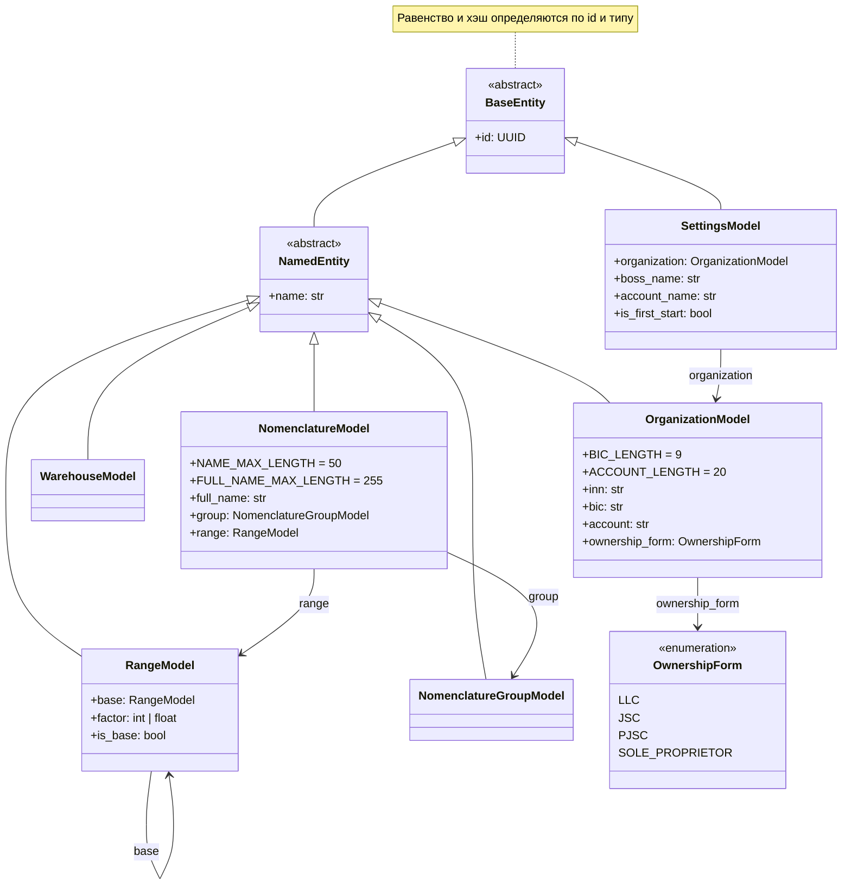
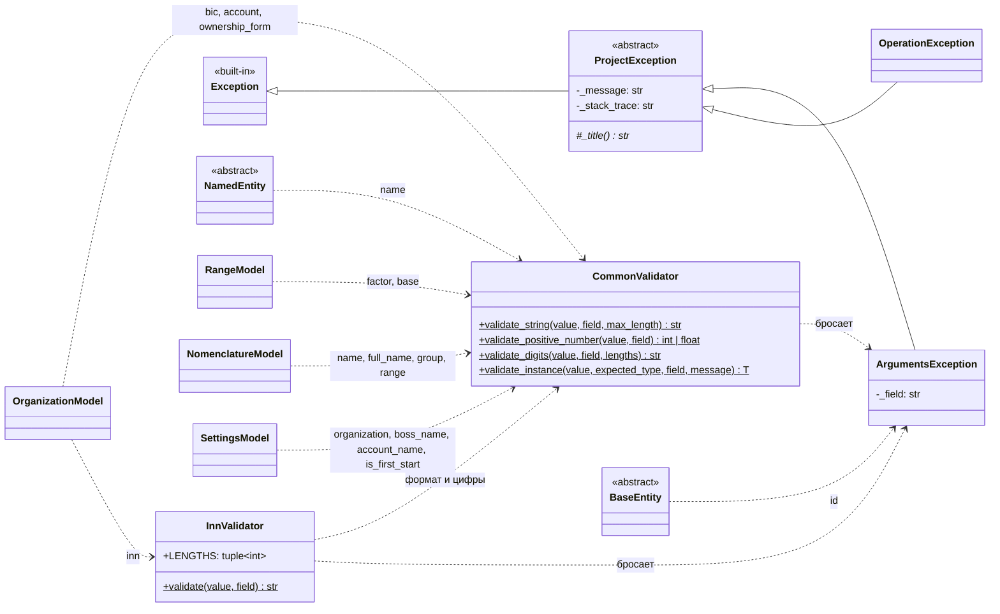
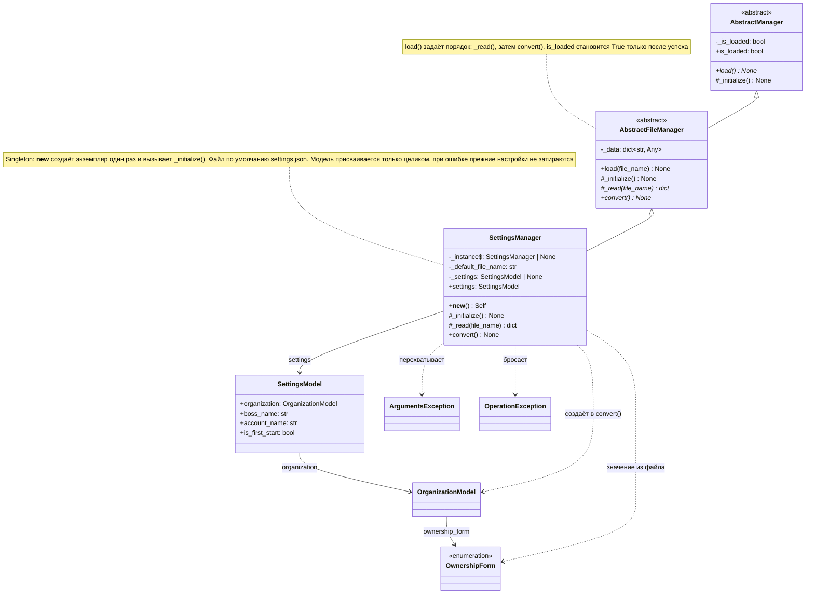
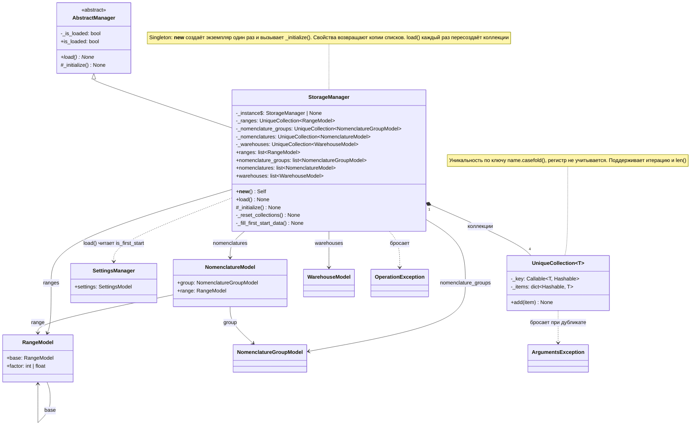

# Диаграммы классов

Диаграммы описывают реализованный код в `Src/`, а не планы из `Docs/DomainEntities.md`.
При добавлении, переименовании или удалении класса обновляйте соответствующую диаграмму.
Mermaid отображается в GitHub и в IDE с поддержкой Markdown.

## Модели

Все модели лежат в `Src/Models/`, базовые классы — в `Src/Core/`.
Стрелка с пустым треугольником — наследование, обычная стрелка — хранимая ссылка на другую модель.

## Проверки и ошибки

Все проверки бросают `ArgumentsException`. Модели вызывают валидаторы из сеттеров.
`OperationException` бросают менеджеры, когда операция не удалась при корректных аргументах
(файл недоступен, настройки не загружены), см. раздел «Менеджеры».

## Менеджеры

Менеджеры лежат в `Src/Logics/`, базовые классы и `UniqueCollection` — в `Src/Core/`.
`AbstractManager` задаёт только общий контракт: флаг `is_loaded` и абстрактный `load()`.
`AbstractFileManager` добавляет работу с файлами: базовый `load(file_name)` сначала вызывает `_read()`,
затем `convert()`. Наследники реализуют `_read()` и `convert()`, но не переопределяют `load()`.
Менеджер без файлов (`StorageManager`) наследует `AbstractManager` напрямую и реализует `load()` сам.
Менеджер — Singleton: каждый конкретный класс реализует это в своём `__new__` и хранит экземпляр
в собственном `_instance`. Базовые классы Singleton не реализуют.
Пунктирная стрелка — зависимость (использует или бросает), стрелка с ромбом — владение.

### SettingsManager

Читает `settings.json` и собирает из него `SettingsModel`. Ошибки модели (`ArgumentsException`) превращает
в `OperationException`, чтобы вызывающий код ловил одно исключение.

### StorageManager

Хранит доменные модели в четырёх коллекциях без дубликатов. При первом запуске (`is_first_start` в настройках)
`load()` наполняет их начальными данными: 5 единиц измерения, 3 группы, 3 номенклатуры и 2 склада.
Номенклатура ссылается на те же объекты единиц и групп, что лежат в коллекциях, а не на копии.
Настройки читаются через `SettingsManager`, поэтому они должны быть загружены до `StorageManager.load()`.
С файлами `StorageManager` не работает, поэтому наследует `AbstractManager`, а не `AbstractFileManager`.

