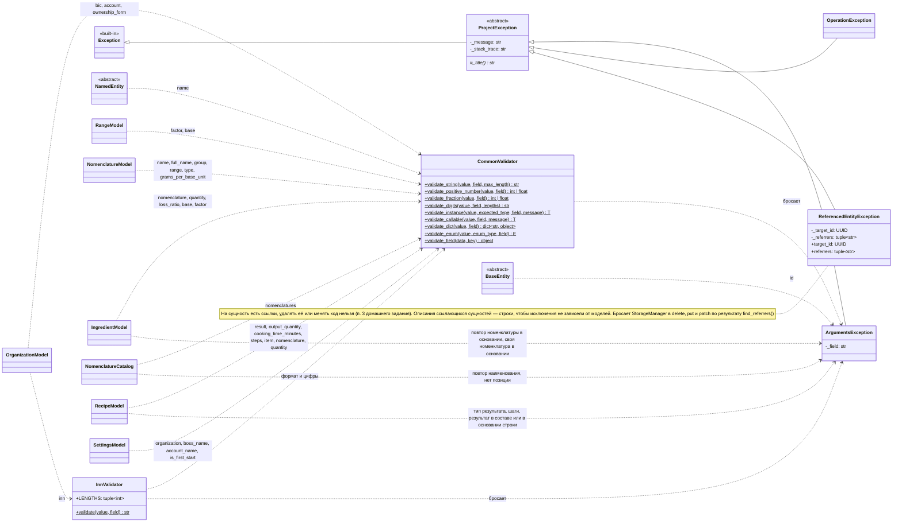
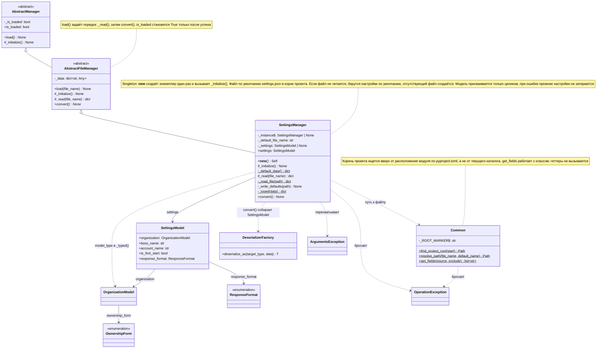
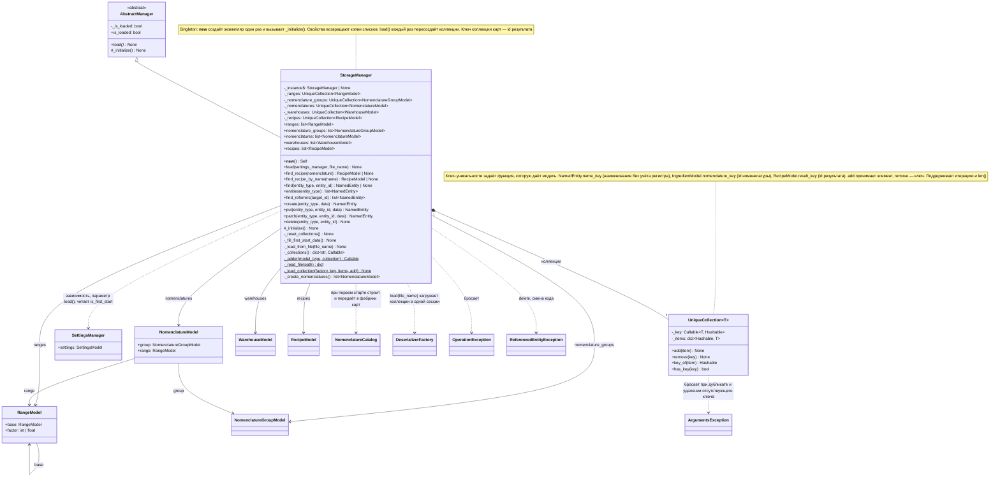
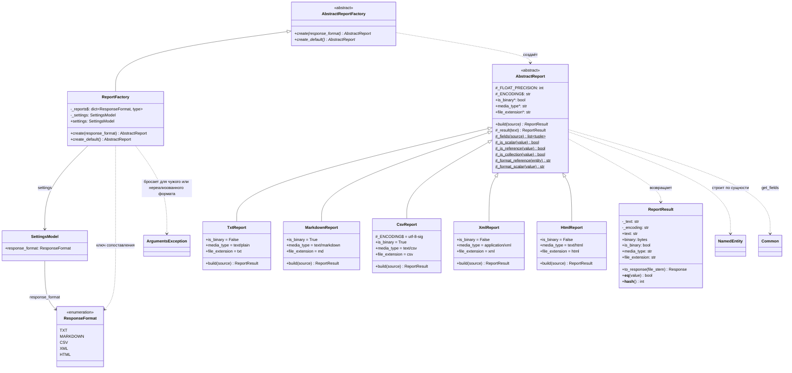
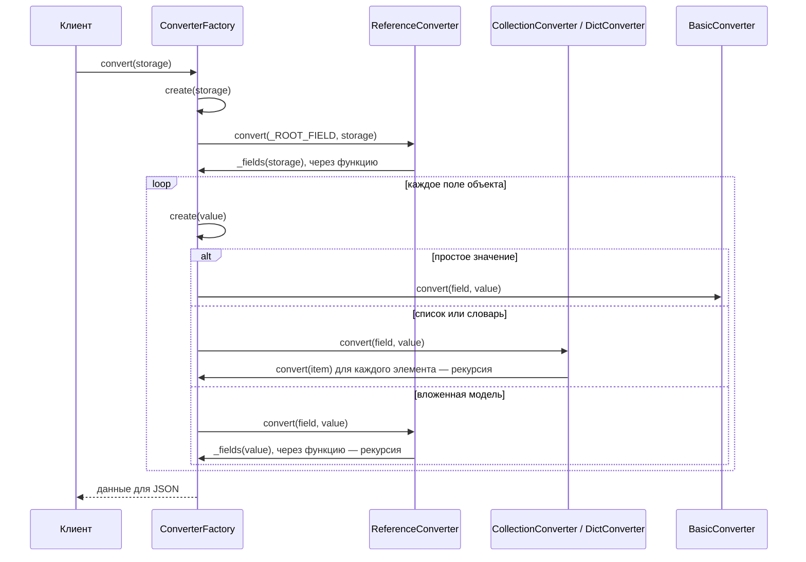
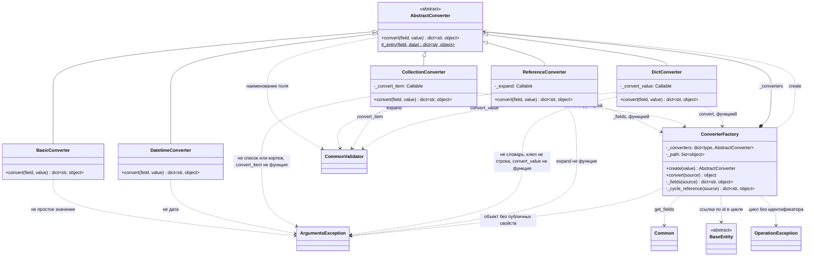
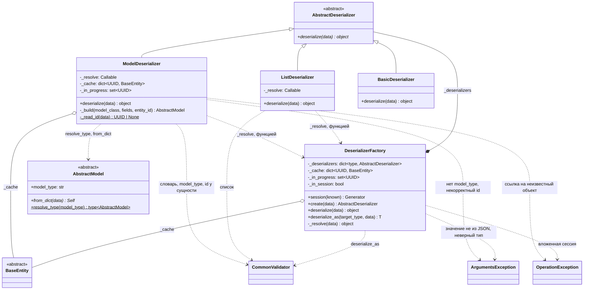

# Диаграммы классов

Диаграммы описывают реализованный код в `Src/`, а не планы из `Docs/DomainEntities.md`.
При добавлении, переименовании или удалении класса обновляйте соответствующую диаграмму.
Mermaid отображается в GitHub и в IDE с поддержкой Markdown.

## Модели

Все модели лежат в `Src/Models/`, базовые классы — в `Src/Core/`.
Стрелка с пустым треугольником — наследование, обычная стрелка — хранимая ссылка на другую модель.

Корень всех моделей — `AbstractModel`: тип модели `model_type` (полное имя класса, его пишет в JSON
`ConverterFactory`) и абстрактный фабричный метод `from_dict` для загрузки из JSON. От него наследуются
`BaseEntity` (сущности с `id`) и `IngredientModel` (строка состава без `id`). В конструкторах моделей
`from_dict` вызывает только сама модель, вложенные модели он получает уже собранными. Наследники
регистрируются в реестре по `model_type` при импорте модуля, `resolve_type` находит по нему класс.
`from_dict` есть у каждой модели, на диаграмме он не повторяется.

```mermaid
classDiagram
    direction TB

    class AbstractModel {
        <<abstract>>
        +TYPE_FIELD$: str
        -_registry$: dict~str, type~
        +model_type: str
        +from_dict(data)* Self
        +resolve_type(model_type)$ type~AbstractModel~
        +type_name(model_class)$ str
    }

    note for AbstractModel "from_dict — абстрактный метод класса (@classmethod). Реестр наследников заполняется в __init_subclass__. resolve_type отвергает неизвестный, абстрактный и нестроковый тип"

    class BaseEntity {
        <<abstract>>
        +id: UUID
        +references() list~BaseEntity~
        +replace_state(other) None
    }

    note for BaseEntity "Равенство и хэш определяются по id и типу. references() — прямые ссылки на другие сущности (по умолчанию пусто): группа и единица у номенклатуры, база у производной единицы, результат и состав у карты. Склад и группа номенклатуры ни на что не ссылаются. Нужен для запрета удаления связанных сущностей. replace_state копирует состояние другой сущности того же типа, чтобы менять сущность на месте: ссылки на неё остаются верными"

    class NamedEntity {
        <<abstract>>
        +name: str
        +name_key() str
    }

    note for NamedEntity "name_key — ключ уникальности по наименованию без учёта регистра, функция ключа UniqueCollection"

    class RangeModel {
        +base: RangeModel
        +factor: int | float
        +is_base: bool
        +references() list~BaseEntity~
        +create_kilogram()$ RangeModel
        +create_liter()$ RangeModel
        +create_piece()$ RangeModel
    }

    class NomenclatureModel {
        +NAME_MAX_LENGTH = 50
        +FULL_NAME_MAX_LENGTH = 255
        +full_name: str
        +group: NomenclatureGroupModel
        +range: RangeModel
        +type: NomenclatureType
        +grams_per_base_unit: int | float
        +references() list~BaseEntity~
        +create_raw_material(name, full_name, group, range, grams_per_base_unit)$ NomenclatureModel
        +create_semi_finished(name, full_name, group, range, grams_per_base_unit)$ NomenclatureModel
        +create_dish(name, full_name, group, range, grams_per_base_unit)$ NomenclatureModel
        +create_packaging(name, full_name, group, range, grams_per_base_unit)$ NomenclatureModel
    }

    class NomenclatureType {
        <<enumeration>>
        RAW_MATERIAL
        PRODUCT
        SEMI_FINISHED
        DISH
        PACKAGING
    }

    class IngredientModel {
        +nomenclature: NomenclatureModel
        +quantity: int | float
        +loss_ratio: int | float
        +base: tuple~IngredientModel~
        +gross_weight: float
        +net_weight: float
        +scaled(factor) IngredientModel
        +contains(nomenclature) bool
        +references() list~BaseEntity~
        +nomenclature_key() UUID
    }

    note for IngredientModel "Строка состава карты, без id (паттерн Компоновщик в одном классе). Пустое base — сырьё или упаковка, вес из количества и grams_per_base_unit. Непустое base — полуфабрикат: снимок карты под это количество, вес — сумма base. base задаётся в конструкторе и копируется, смена quantity масштабирует его. Веса вычисляются при каждом обращении. О картах не знает"

    class NomenclatureCatalog {
        +get(name) NomenclatureModel
    }

    note for NomenclatureCatalog "Справочник номенклатуры: поиск по наименованию. Не владеет позициями, возвращает те же экземпляры. Повтор наименования отвергается"

    class RecipeModel {
        +RESULT_TYPES: frozenset~NomenclatureType~
        +result: NomenclatureModel
        +output_quantity: int | float
        +cooking_time_minutes: int | float
        +steps: list~str~
        +items: list~IngredientModel~
        +gross_weight: float
        +net_weight: float
        +gross_weight_for(output_quantity) float
        +net_weight_for(output_quantity) float
        +add_item(item) None
        +remove_item(nomenclature) None
        +as_ingredient(quantity, loss_ratio) IngredientModel
        +references() list~BaseEntity~
        +result_key() UUID
        +create_beef_bouillon(catalog)$ RecipeModel
        +create_boiled_beef(catalog)$ RecipeModel
        +create_beet_fry(catalog)$ RecipeModel
        +create_borscht(catalog, bouillon?, boiled_beef?, beet_fry?)$ RecipeModel
    }

    note for RecipeModel "Результат (полуфабрикат или блюдо) только для чтения. Ингредиенты состава уникальны по номенклатуре. Веса брутто и нетто — сумма по ингредиентам, рекурсия получается сама. as_ingredient собирает снимок карты для состава другой карты. add_item отвергает строку, в дереве которой есть результат карты. gross_weight_for и net_weight_for масштабируют веса под заданный выход. Фабрики карт принимают NomenclatureCatalog. create_borscht сам создаёт не переданные карты полуфабрикатов, ошибки не скрывает"

    class NomenclatureGroupModel {
        +create_meat()$ NomenclatureGroupModel
        +create_dairy()$ NomenclatureGroupModel
        +create_vegetables()$ NomenclatureGroupModel
        +create_grocery()$ NomenclatureGroupModel
        +create_semi_finished()$ NomenclatureGroupModel
        +create_dishes()$ NomenclatureGroupModel
        +create_packaging()$ NomenclatureGroupModel
    }

    class WarehouseModel {
        +create_restaurant_warehouse()$ WarehouseModel
        +create_workshop_warehouse()$ WarehouseModel
    }

    class SettingsModel {
        +organization: OrganizationModel
        +boss_name: str
        +account_name: str
        +is_first_start: bool
        +response_format: ResponseFormat
    }

    class OrganizationModel {
        +BIC_LENGTH = 9
        +ACCOUNT_LENGTH = 20
        +inn: str
        +bic: str
        +account: str
        +ownership_form: OwnershipForm
    }

    class OwnershipForm {
        <<enumeration>>
        LLC
        JSC
        PJSC
        SOLE_PROPRIETOR
    }

    class ResponseFormat {
        <<enumeration>>
    }

    AbstractModel <|-- BaseEntity
    AbstractModel <|-- IngredientModel
    BaseEntity <|-- NamedEntity
    BaseEntity <|-- SettingsModel
    NamedEntity <|-- RangeModel
    NamedEntity <|-- NomenclatureModel
    NamedEntity <|-- NomenclatureGroupModel
    NamedEntity <|-- WarehouseModel
    NamedEntity <|-- OrganizationModel
    NamedEntity <|-- RecipeModel

    NomenclatureModel --> NomenclatureGroupModel : group
    NomenclatureModel --> RangeModel : range
    NomenclatureModel --> NomenclatureType : type
    IngredientModel --> NomenclatureModel : nomenclature
    IngredientModel "1" *-- "0..*" IngredientModel : base
    RecipeModel --> NomenclatureModel : result
    RecipeModel "1" *-- "*" IngredientModel : items
    RecipeModel ..> IngredientModel : as_ingredient
    NomenclatureCatalog o-- NomenclatureModel : items
    RecipeModel ..> NomenclatureCatalog : фабрики карт
    RangeModel --> RangeModel : base
    OrganizationModel --> OwnershipForm : ownership_form
    SettingsModel --> OrganizationModel : organization
    SettingsModel --> ResponseFormat : response_format
```

## Рецепты

Модели технологических карт (п. 2.1 и 2.5 ТЗ) и то, как они связаны с номенклатурой и хранилищем.
Те же классы показаны на общей диаграмме выше, здесь оставлено только относящееся к рецептам.

- Карта (`RecipeModel`) получает одну номенклатуру-результат: полуфабрикат или блюдо.
- Состав — ингредиенты `IngredientModel` без собственного `id`: внутри карты строку определяет номенклатура.
  Строка хранит количество в базовой единице номенклатуры, долю потерь и основание `base` — состав этого количества.
  «Компоновщик» в одном классе: пустое `base` — сырьё или упаковка, непустое — полуфабрикат или блюдо со своей картой.
- Вес сырья: брутто = `quantity * grams_per_base_unit`, нетто = брутто * (1 − `loss_ratio`).
- Вес составной строки: брутто = сумма брутто `base`, нетто = сумма нетто `base` * (1 − `loss_ratio`).
  Вес карты — сумма по строкам, вычисляется при каждом обращении.
- Полуфабрикат входит в карту снимком: `recipe.as_ingredient(quantity, loss_ratio)` копирует состав карты,
  масштабированный на `quantity / output_quantity`. Основание — производные данные, источник истины — карта
  полуфабриката (`StorageManager.find_recipe()` по номенклатуре строки). Правка карты уже собранные строки не меняет,
  каскадную пересборку в будущем возьмёт на себя наблюдатель. Ингредиент о картах не знает, цикла импортов нет.
- Циклы по ссылкам невозможны: `base` задаётся в конструкторе и копируется. `RecipeModel.add_item` отвергает строку,
  в дереве которой есть результат карты (`IngredientModel.contains`). Проверка надёжна, пока снимки свежие:
  устаревший снимок может не увидеть цепочку, добавленную после его сборки.
- Фабрики `create_*` собирают карты из `Recipes.md` по справочнику `NomenclatureCatalog` (поиск номенклатуры по наименованию).

```mermaid
classDiagram
    direction LR

    class NomenclatureType {
        <<enumeration>>
        RAW_MATERIAL
        PRODUCT
        SEMI_FINISHED
        DISH
        PACKAGING
    }

    class NomenclatureModel {
        +type: NomenclatureType
        +grams_per_base_unit: int | float
    }

    class IngredientModel {
        +nomenclature: NomenclatureModel
        +quantity: int | float
        +loss_ratio: int | float
        +base: tuple~IngredientModel~
        +gross_weight: float
        +net_weight: float
        +scaled(factor) IngredientModel
        +contains(nomenclature) bool
        +nomenclature_key() UUID
    }

    note for IngredientModel "Строка состава, без id. loss_ratio от 0 включительно до 1 не включая. Пустое base — сырьё, непустое — снимок карты полуфабриката. contains нужен карте, чтобы не включить снимок самой себя"

    class NomenclatureCatalog {
        +get(name) NomenclatureModel
    }

    note for NomenclatureCatalog "Справочник номенклатуры: поиск по наименованию. Не владеет позициями, возвращает те же экземпляры. Повтор наименования отвергается"

    class RecipeModel {
        +RESULT_TYPES: frozenset~NomenclatureType~
        +result: NomenclatureModel
        +output_quantity: int | float
        +cooking_time_minutes: int | float
        +steps: list~str~
        +items: list~IngredientModel~
        +gross_weight: float
        +net_weight: float
        +gross_weight_for(output_quantity) float
        +net_weight_for(output_quantity) float
        +add_item(item) None
        +remove_item(nomenclature) None
        +as_ingredient(quantity, loss_ratio) IngredientModel
        +result_key() UUID
        +create_beef_bouillon(catalog)$ RecipeModel
        +create_boiled_beef(catalog)$ RecipeModel
        +create_beet_fry(catalog)$ RecipeModel
        +create_borscht(catalog, bouillon?, boiled_beef?, beet_fry?)$ RecipeModel
    }

    note for RecipeModel "Результат — только SEMI_FINISHED или DISH, задаётся в конструкторе. Брутто и нетто — сумма по элементам. gross_weight_for и net_weight_for масштабируют веса под заданный объём. Результат не может входить в состав своей карты, в том числе в основание строки. as_ingredient масштабирует состав под количество строки"

    class UniqueCollection~T~ {
        +add(item) None
        +remove(key) None
        +key_of(item) Hashable
        +has_key(key) bool
    }

    note for UniqueCollection "Функцию ключа даёт сама модель: IngredientModel.nomenclature_key (id номенклатуры), RecipeModel.result_key (id результата), NamedEntity.name_key (наименование)"

    class StorageManager {
        +recipes: list~RecipeModel~
        +find_recipe(nomenclature) RecipeModel | None
        +find_recipe_by_name(name) RecipeModel | None
        +find(entity_type, entity_id) NamedEntity | None
        +entities(entity_type) list~NamedEntity~
        +find_referrers(target_id) list~NamedEntity~
        +create(entity_type, data) NamedEntity
        +put(entity_type, entity_id, data) NamedEntity
        +patch(entity_type, entity_id, data) NamedEntity
        +delete(entity_type, entity_id) None
    }

    note for StorageManager "Одна карта на номенклатуру-результат. Включение снимка самой себя отвергает карта при добавлении строки, хранилище его не проверяет"

    class ArgumentsException

    NomenclatureModel --> NomenclatureType : type
    IngredientModel --> NomenclatureModel : nomenclature
    IngredientModel "1" *-- "0..*" IngredientModel : base
    RecipeModel --> NomenclatureModel : result
    RecipeModel "1" *-- "*" IngredientModel : items
    RecipeModel ..> IngredientModel : as_ingredient
    NomenclatureCatalog o-- NomenclatureModel : items
    RecipeModel ..> NomenclatureCatalog : фабрики карт
    RecipeModel *-- UniqueCollection : items
    StorageManager *-- UniqueCollection : recipes
    StorageManager --> RecipeModel : recipes
    RecipeModel ..> ArgumentsException : нет номенклатуры в справочнике, дубликат, результат в составе или в основании строки
    StorageManager ..> ArgumentsException : вторая карта на результат
```

Пример составной карты: «Борщ с говядиной» (блюдо) включает полуфабрикаты «Бульон костный говяжий»,
«Говядина отварная», «Зажарка свекольная» и упаковку «Контейнер для супа 500 мл». Каждый полуфабрикат входит
снимком своей карты (`as_ingredient`) с количеством и потерями строки, а карты полуфабрикатов состоят только из сырья,
поэтому циклов в начальных данных нет.

## Проверки и ошибки

Все проверки бросают `ArgumentsException`. Модели вызывают валидаторы из сеттеров.
`OperationException` бросают менеджеры, когда операция не удалась при корректных аргументах
(файл недоступен, настройки не загружены), см. раздел «Менеджеры».

```mermaid
classDiagram
    direction LR

    class CommonValidator {
        +validate_string(value, field, max_length)$ str
        +validate_positive_number(value, field)$ int | float
        +validate_fraction(value, field)$ int | float
        +validate_digits(value, field, lengths)$ str
        +validate_instance(value, expected_type, field, message)$ T
        +validate_callable(value, field, message)$ T
        +validate_dict(value, field)$ dict~str, object~
        +validate_enum(value, enum_type, field)$ E
        +validate_field(data, key)$ object
    }

    class InnValidator {
        +LENGTHS: tuple~int~
        +validate(value, field)$ str
    }

    class ProjectException {
        <<abstract>>
        -_message: str
        -_stack_trace: str
        #_title()* str
    }

    class ArgumentsException {
        -_field: str
    }

    class OperationException

    class ReferencedEntityException {
        -_target_id: UUID
        -_referrers: tuple~str~
        +target_id: UUID
        +referrers: tuple~str~
    }

    note for ReferencedEntityException "На сущность есть ссылки, удалять её или менять код нельзя (п. 3 домашнего задания). Описания ссылающихся сущностей — строки, чтобы исключения не зависели от моделей. Бросает StorageManager в delete, put и patch по результату find_referrers()"

    class Exception {
        <<built-in>>
    }

    class NamedEntity {
        <<abstract>>
    }

    class BaseEntity {
        <<abstract>>
    }

    class RangeModel
    class NomenclatureModel
    class IngredientModel
    class NomenclatureCatalog
    class RecipeModel
    class OrganizationModel
    class SettingsModel

    Exception <|-- ProjectException
    ProjectException <|-- ArgumentsException
    ProjectException <|-- OperationException
    ProjectException <|-- ReferencedEntityException
    InnValidator ..> CommonValidator : формат и цифры
    CommonValidator ..> ArgumentsException : бросает
    InnValidator ..> ArgumentsException : бросает
    BaseEntity ..> ArgumentsException : id
    NamedEntity ..> CommonValidator : name
    RangeModel ..> CommonValidator : factor, base
    NomenclatureModel ..> CommonValidator : name, full_name, group, range, type, grams_per_base_unit
    IngredientModel ..> CommonValidator : nomenclature, quantity, loss_ratio, base, factor
    IngredientModel ..> ArgumentsException : повтор номенклатуры в основании, своя номенклатура в основании
    NomenclatureCatalog ..> CommonValidator : nomenclatures
    NomenclatureCatalog ..> ArgumentsException : повтор наименования, нет позиции
    RecipeModel ..> CommonValidator : result, output_quantity, cooking_time_minutes, steps, item, nomenclature, quantity
    RecipeModel ..> ArgumentsException : тип результата, шаги, результат в составе или в основании строки
    OrganizationModel ..> CommonValidator : bic, account, ownership_form
    OrganizationModel ..> InnValidator : inn
    SettingsModel ..> CommonValidator : organization, boss_name, account_name, is_first_start
```

## Менеджеры

Менеджеры лежат в `Src/Logics/`, базовые классы и `UniqueCollection` — в `Src/Core/`.
`AbstractManager` задаёт только общий контракт: флаг `is_loaded` и абстрактный `load()`.
`AbstractFileManager` добавляет работу с файлами: базовый `load(file_name)` сначала вызывает `_read()`,
затем `convert()`. Наследники реализуют `_read()` и `convert()`, но не переопределяют `load()`.
Менеджер без файлов (`StorageManager`) наследует `AbstractManager` напрямую и реализует `load()` сам.
Менеджер — Singleton: каждый конкретный класс реализует это в своём `__new__` и хранит экземпляр
в собственном `_instance`. Базовые классы Singleton не реализуют.
Пунктирная стрелка — зависимость (использует или бросает), стрелка с ромбом — владение.

### SettingsManager

Читает `settings.json` и собирает из него `SettingsModel` общим механизмом десериализации — `DeserializerFactory`,
тем же, что загружает хранилище из файла. Модели создают себя сами (`from_dict`), поэтому правила полей
(обязательные, значения по умолчанию, перечисления) описаны один раз, в моделях. В файле настроек, который правит
человек, нет служебного `model_type`: его подставляет `_typed()` для корня и карточки организации, а уже указанный
тип не заменяет. Ошибки модели (`ArgumentsException`) превращает в `OperationException`, чтобы вызывающий код
ловил одно исключение.

```mermaid
classDiagram
    direction TB

    class AbstractManager {
        <<abstract>>
        -_is_loaded: bool
        +is_loaded: bool
        +load()* None
        #_initialize() None
    }

    class AbstractFileManager {
        <<abstract>>
        -_data: dict~str, Any~
        +load(file_name) None
        #_initialize() None
        #_read(file_name)* dict
        +convert()* None
    }

    note for AbstractFileManager "load() задаёт порядок: _read(), затем convert(). is_loaded становится True только после успеха"

    class Common {
        -_ROOT_MARKER$: str
        +find_project_root(start)$ Path
        +resolve_path(file_name, default_name)$ Path
        +get_fields(source, exclude)$ list~str~
    }

    note for Common "Корень проекта ищется вверх от расположения модуля по pyproject.toml, а не от текущего каталога. get_fields работает с классом: геттеры не вызываются"

    class SettingsManager {
        -_instance$: SettingsManager | None
        -_default_file_name: str
        -_settings: SettingsModel | None
        +settings: SettingsModel
        +__new__() Self
        #_initialize() None
        -_default_data()$ dict
        #_read(file_name) dict
        -_read_file(path)$ dict
        -_write_defaults(path) None
        -_typed(data)$ dict
        +convert() None
    }

    note for SettingsManager "Singleton: __new__ создаёт экземпляр один раз и вызывает _initialize(). Файл по умолчанию settings.json в корне проекта. Если файл не читается, берутся настройки по умолчанию, отсутствующий файл создаётся. Модель присваивается только целиком, при ошибке прежние настройки не затираются"

    class SettingsModel {
        +organization: OrganizationModel
        +boss_name: str
        +account_name: str
        +is_first_start: bool
        +response_format: ResponseFormat
    }

    class OrganizationModel
    class OwnershipForm {
        <<enumeration>>
    }
    class ResponseFormat {
        <<enumeration>>
    }
    class DeserializerFactory {
        +deserialize_as(target_type, data) T
    }
    class ArgumentsException
    class OperationException

    AbstractManager <|-- AbstractFileManager
    AbstractFileManager <|-- SettingsManager
    SettingsManager --> SettingsModel : settings
    SettingsModel --> OrganizationModel : organization
    OrganizationModel --> OwnershipForm : ownership_form
    SettingsModel --> ResponseFormat : response_format
    SettingsManager ..> Common : путь к файлу
    Common ..> OperationException : бросает
    SettingsManager ..> DeserializerFactory : convert() собирает SettingsModel
    SettingsManager ..> OrganizationModel : model_type в _typed()
    SettingsManager ..> ArgumentsException : перехватывает
    SettingsManager ..> OperationException : бросает
```

### StorageManager

Хранит доменные модели в пяти коллекциях без дубликатов. При первом запуске (`is_first_start` в настройках)
`load()` наполняет их начальными данными через фабричные методы моделей: 5 единиц измерения, 7 групп,
24 номенклатуры, 2 склада и 4 технологические карты из `Recipes.md`.
Номенклатура ссылается на те же объекты единиц и групп, что лежат в коллекциях, а карты — на те же объекты номенклатуры, а не на копии.
Циклы включений хранилище не проверяет: снимок самой себя отвергает карта при добавлении строки (`RecipeModel.add_item`).
Карту полуфабриката находит `find_recipe()` по номенклатуре-результату, на одну позицию допускается одна карта.
По наименованию карту ищет `find_recipe_by_name()` (без учёта регистра), её использует API отчёта.
Сущность по типу (`EntityType`: номенклатура, группа номенклатуры, единица измерения, склад, карта) и коду ищет `find()` перебором коллекции этого типа,
все сущности типа возвращает `entities()` (копия списка): по ним API отдаёт коллекцию.
Сущности, ссылающиеся на сущность с заданным кодом (по `references()`), возвращает `find_referrers()`: он обходит все коллекции, которые перечисляет `_entity_collections()`. Это основа запрета удаления связанных сущностей.
Изменяют хранилище `create`, `put`, `patch` и `delete` (их вызывают CRUD-маршруты API `/api/entities/...`). Данные — словарь в формате выгрузки,
вложенные сущности хранилища задаются ссылкой `{"id": ...}`, `model_type` необязателен. `put` заменяет все поля,
`patch` накладывает указанные на текущие (выгрузка сущности + данные). Сущность собирается в стороне через
`DeserializerFactory.session(known)`, где известны все сущности хранилища, и проверяется до первого изменения:
ссылки должны вести на сущности хранилища, код — быть свободным, наименование — уникальным. Затем состояние
переносится на месте (`BaseEntity.replace_state`), а коллекция перестраивается, если ключ изменился. Удалить сущность
или сменить ей код, пока на неё ссылаются, нельзя: `ReferencedEntityException`. Остальные поля у связанной сущности
менять можно. Каскадной пересборки снимков карт при правке сущностей пока нет.
Хранилище зависит от менеджера настроек: `load(settings_manager)` принимает его параметром, по умолчанию берёт
единственный `SettingsManager`. Настройки должны быть загружены до `StorageManager.load()`, сам `load()` их не загружает.
Если в `load(file_name=...)` указан файл, коллекции читаются из него, а настройки не нужны и флаг первого запуска
не учитывается. Файл — выгрузка хранилища через `ConverterFactory` (ключи `ranges`, `nomenclature_groups`,
`nomenclatures`, `warehouses`, `recipes`). Состав хранилища описан один раз, в `_collections()`: ключ коллекции
и функция, которая проверяет тип модели и добавляет её в коллекцию. Загрузка идёт циклом по ключам файла
в их порядке, лишние ключи (`is_loaded`) пропускаются, отсутствующая коллекция — ошибка. Какую модель собирать,
говорит сам файл (`model_type`). Все коллекции загружаются в одной сессии `DeserializerFactory`, поэтому
единицы, группы и номенклатура становятся общими объектами, а не копиями, и `find_recipe()` их находит.
Порядок коллекций в файле на результат не влияет: модели записаны целиком, общие объекты сводит кэш по `id`.
`StorageManager` читает файл сам, а не через `AbstractFileManager`: у того `load(file_name)` и жёсткая схема
`_read` + `convert`, а хранилищу нужен ещё и параметр `settings_manager`, поэтому наследует `AbstractManager`.

```mermaid
classDiagram
    direction TB

    class AbstractManager {
        <<abstract>>
        -_is_loaded: bool
        +is_loaded: bool
        +load()* None
        #_initialize() None
    }

    class StorageManager {
        -_instance$: StorageManager | None
        -_ranges: UniqueCollection~RangeModel~
        -_nomenclature_groups: UniqueCollection~NomenclatureGroupModel~
        -_nomenclatures: UniqueCollection~NomenclatureModel~
        -_warehouses: UniqueCollection~WarehouseModel~
        -_recipes: UniqueCollection~RecipeModel~
        +ranges: list~RangeModel~
        +nomenclature_groups: list~NomenclatureGroupModel~
        +nomenclatures: list~NomenclatureModel~
        +warehouses: list~WarehouseModel~
        +recipes: list~RecipeModel~
        +__new__() Self
        +load(settings_manager, file_name) None
        +find_recipe(nomenclature) RecipeModel | None
        +find_recipe_by_name(name) RecipeModel | None
        +find(entity_type, entity_id) NamedEntity | None
        +entities(entity_type) list~NamedEntity~
        +find_referrers(target_id) list~NamedEntity~
        +create(entity_type, data) NamedEntity
        +put(entity_type, entity_id, data) NamedEntity
        +patch(entity_type, entity_id, data) NamedEntity
        +delete(entity_type, entity_id) None
        #_initialize() None
        -_reset_collections() None
        -_fill_first_start_data() None
        -_load_from_file(file_name) None
        -_collections() dict~str, Callable~
        -_adder(model_type, collection)$ Callable
        -_read_file(path)$ dict
        -_load_collection(factory, key, items, add)$ None
        -_create_nomenclatures() list~NomenclatureModel~
    }

    note for StorageManager "Singleton: __new__ создаёт экземпляр один раз и вызывает _initialize(). Свойства возвращают копии списков. load() каждый раз пересоздаёт коллекции. Ключ коллекции карт — id результата"

    class UniqueCollection~T~ {
        -_key: Callable~T, Hashable~
        -_items: dict~Hashable, T~
        +add(item) None
        +remove(key) None
        +key_of(item) Hashable
        +has_key(key) bool
    }

    note for UniqueCollection "Ключ уникальности задаёт функция, которую даёт модель: NamedEntity.name_key (наименование без учёта регистра), IngredientModel.nomenclature_key (id номенклатуры), RecipeModel.result_key (id результата). add принимает элемент, remove — ключ. Поддерживает итерацию и len()"

    class SettingsManager {
        +settings: SettingsModel
    }

    class RangeModel {
        +base: RangeModel
        +factor: int | float
    }

    class NomenclatureModel {
        +group: NomenclatureGroupModel
        +range: RangeModel
    }

    class NomenclatureGroupModel
    class WarehouseModel
    class RecipeModel
    class NomenclatureCatalog
    class DeserializerFactory
    class ArgumentsException
    class OperationException
    class ReferencedEntityException

    AbstractManager <|-- StorageManager
    StorageManager "1" *-- "5" UniqueCollection : коллекции
    StorageManager ..> SettingsManager : зависимость, параметр load(), читает is_first_start
    StorageManager --> RangeModel : ranges
    StorageManager --> NomenclatureGroupModel : nomenclature_groups
    StorageManager --> NomenclatureModel : nomenclatures
    StorageManager --> WarehouseModel : warehouses
    StorageManager --> RecipeModel : recipes
    StorageManager ..> NomenclatureCatalog : при первом старте строит и передаёт в фабрики карт
    StorageManager ..> DeserializerFactory : load(file_name) загружает коллекции в одной сессии
    NomenclatureModel --> NomenclatureGroupModel : group
    NomenclatureModel --> RangeModel : range
    RangeModel --> RangeModel : base
    UniqueCollection ..> ArgumentsException : бросает при дубликате и удалении отсутствующего ключа
    StorageManager ..> OperationException : бросает
    StorageManager ..> ReferencedEntityException : delete, смена кода
```

## Отчёты

Отчёт формирует по сущности результат в одном из форматов (`ResponseFormat`). У каждого формата свой класс отчёта
со своей реализацией `build()` и своими признаками выдачи (`is_binary`, `media_type`, `file_extension`).
Клиент получает отчёт от фабрики по формату и работает только с абстракцией `AbstractReport`
(паттерн «Абстрактная фабрика»). Абстракции лежат в `Src/Core/`, отчёты и фабрика — в `Src/Logics/`,
результат `ReportResult` — в `Src/Dtos/`.

Фабрика хранит настройки (`SettingsModel`): `create(response_format)` создаёт отчёт явно указанного формата,
`create_default()` — формата из `SettingsModel.response_format`. Новый формат подключается строкой в `_reports`.

Общие для всех форматов правила обхода заданы в `AbstractReport`: поля — публичные свойства (`Common.get_fields`),
вложенная сущность с наименованием выводится ссылкой (наименование и код), списки — поэлементно,
остальные объекты раскрываются по дереву «Компоновщика» (`RecipeModel.items`, `IngredientModel.base`).
Так не зацикливается `RangeModel.base` у базовой единицы, а все форматы выводят один и тот же состав данных.

Результат — объект-значение: без идентификатора, неизменяем, равенство по содержимому и способу выдачи.
Он один на все форматы: формат знает про себя отчёт и передаёт результату MIME-тип, расширение и признак
файла (`AbstractReport._result()`). `is_binary` подсказывает API, отдавать ли результат файлом на скачивание
(Markdown, CSV) или текстом (TXT, XML, HTML). Сам результат собирает HTTP-ответ (`to_response()`), поэтому
`fastapi` нужен только в `Src/Dtos/` и `Src/main.py`, а не в ядре. CSV кодируется с меткой UTF-8 для Excel
(`CsvReport._ENCODING`). Компромисс: `AbstractReport` из `Src/Core/` импортирует `ReportResult` из `Src/Dtos/`.

```mermaid
classDiagram
    direction TB

    class AbstractReportFactory {
        <<abstract>>
        +create(response_format)* AbstractReport
        +create_default()* AbstractReport
    }

    class ReportFactory {
        -_reports$: dict~ResponseFormat, type~
        -_settings: SettingsModel
        +settings: SettingsModel
        +create(response_format) AbstractReport
        +create_default() AbstractReport
    }

    class AbstractReport {
        <<abstract>>
        #_FLOAT_PRECISION: int
        #_ENCODING$: str
        +is_binary*: bool
        +media_type*: str
        +file_extension*: str
        +build(source)* ReportResult
        #_result(text) ReportResult
        #_fields(source)$ list~tuple~
        #_is_scalar(value)$ bool
        #_is_reference(value)$ bool
        #_is_collection(value)$ bool
        #_format_reference(entity)$ str
        #_format_scalar(value)$ str
    }

    class TxtReport {
        +is_binary = False
        +media_type = text/plain
        +file_extension = txt
        +build(source) ReportResult
    }

    class MarkdownReport {
        +is_binary = True
        +media_type = text/markdown
        +file_extension = md
        +build(source) ReportResult
    }

    class CsvReport {
        #_ENCODING$ = utf-8-sig
        +is_binary = True
        +media_type = text/csv
        +file_extension = csv
        +build(source) ReportResult
    }

    class XmlReport {
        +is_binary = False
        +media_type = application/xml
        +file_extension = xml
        +build(source) ReportResult
    }

    class HtmlReport {
        +is_binary = False
        +media_type = text/html
        +file_extension = html
        +build(source) ReportResult
    }

    class ReportResult {
        -_text: str
        -_encoding: str
        +text: str
        +binary: bytes
        +is_binary: bool
        +media_type: str
        +file_extension: str
        +to_response(file_stem) Response
        +__eq__(value) bool
        +__hash__() int
    }

    class ResponseFormat {
        <<enumeration>>
        TXT
        MARKDOWN
        CSV
        XML
        HTML
    }

    class SettingsModel {
        +response_format: ResponseFormat
    }

    class NamedEntity
    class Common
    class ArgumentsException

    AbstractReportFactory <|-- ReportFactory
    AbstractReport <|-- TxtReport
    AbstractReport <|-- MarkdownReport
    AbstractReport <|-- CsvReport
    AbstractReport <|-- XmlReport
    AbstractReport <|-- HtmlReport
    AbstractReportFactory ..> AbstractReport : создаёт
    ReportFactory --> SettingsModel : settings
    SettingsModel --> ResponseFormat : response_format
    ReportFactory ..> ResponseFormat : ключ сопоставления
    AbstractReport ..> ReportResult : возвращает
    AbstractReport ..> NamedEntity : строит по сущности
    AbstractReport ..> Common : get_fields
    ReportFactory ..> ArgumentsException : бросает для чужого или нереализованного формата
```

## Конвертация

Конвертеры превращают любой объект в данные, которые `json.dumps` записывает без настроек: модель — словарь
«наименование поля — данные поля», список моделей — список словарей, простое значение — само значение.
Это основа сериализации: модель или всё хранилище сначала становится словарём, а словарь — JSON.
Абстракция лежит в `Src/Core/`, конвертеры и фабрика — в `Src/Logics/`.

Клиент вызывает только `ConverterFactory.convert(source)`, где `source` — объект любого типа. Фабрика выбирает
конвертер по типу значения (`create()`) по сопоставлению `_converters` с обходом MRO типа, без цепочки `isinstance`:

| Тип значения                                   | Конвертер             | Данные                                  |
|------------------------------------------------|-----------------------|-----------------------------------------|
| `str`, `int`, `float`, `bool`, `None`          | `BasicConverter`      | как есть                                |
| `Enum`, `UUID`                                 | `BasicConverter`      | значение перечисления, строка кода      |
| `date`, `datetime`                             | `DatetimeConverter`   | строка ISO 8601                         |
| `list`, `tuple`                                | `CollectionConverter` | список данных элементов                 |
| `dict` со строковыми ключами                   | `DictConverter`       | словарь данных значений                 |
| остальные объекты (`object`): модели и т. п.   | `ReferenceConverter`  | вложенный словарь полей                 |

Конвертер возвращает `{поле: данные}`, а у значения верхнего уровня поля нет. Поэтому `convert` передаёт
служебное наименование `_ROOT_FIELD` и сразу снимает его с результата.

Рекурсия: `ReferenceConverter` раскрывает объект через `ConverterFactory._fields`, а тот для каждого поля
(`Common.get_fields`) снова выбирает конвертер. `CollectionConverter` и `DictConverter` отдают каждый элемент
в `ConverterFactory.convert`. Фабрика передаёт конвертерам свои методы функциями, поэтому конвертеры
не зависят от её класса и цикла импортов нет.

```mermaid
sequenceDiagram
    participant Client as Клиент
    participant F as ConverterFactory
    participant R as ReferenceConverter
    participant C as CollectionConverter / DictConverter
    participant B as BasicConverter

    Client->>F: convert(storage)
    F->>F: create(storage)
    F->>R: convert(_ROOT_FIELD, storage)
    R->>F: _fields(storage), через функцию
    loop каждое поле объекта
        F->>F: create(value)
        alt простое значение
            F->>B: convert(field, value)
        else список или словарь
            F->>C: convert(field, value)
            C->>F: convert(item) для каждого элемента — рекурсия
        else вложенная модель
            F->>R: convert(field, value)
            R->>F: _fields(value), через функцию — рекурсия
        end
    end
    F-->>Client: данные для JSON
```

Защита от циклов: фабрика помнит путь от корня до текущего объекта. Объект, который уже есть на пути
(у базовой единицы `RangeModel.base` — она сама), записывается ссылкой `{"id": ...}`. Цикл через объект
без идентификатора — `OperationException`. Общая модель без цикла (одна группа у разных позиций) раскрывается
везде целиком. Поля — все публичные свойства, поэтому вычисляемые (`is_base`, веса) тоже попадают в словарь.
Объект без публичных свойств (функция, множество) — `ArgumentsException`: пустой словарь молча потерял бы данные.

```mermaid
classDiagram
    direction TB

    class AbstractConverter {
        <<abstract>>
        +convert(field, value)* dict~str, object~
        #_entry(field, data)$ dict~str, object~
    }

    class BasicConverter {
        +convert(field, value) dict~str, object~
    }

    class DatetimeConverter {
        +convert(field, value) dict~str, object~
    }

    class ReferenceConverter {
        -_expand: Callable
        +convert(field, value) dict~str, object~
    }

    class CollectionConverter {
        -_convert_item: Callable
        +convert(field, value) dict~str, object~
    }

    class DictConverter {
        -_convert_value: Callable
        +convert(field, value) dict~str, object~
    }

    class ConverterFactory {
        -_converters: dict~type, AbstractConverter~
        -_path: list~object~
        +create(value) AbstractConverter
        +convert(source) object
        -_fields(source) dict~str, object~
        -_cycle_reference(source) dict~str, object~
    }

    class Common
    class CommonValidator
    class BaseEntity {
        <<abstract>>
    }
    class ArgumentsException
    class OperationException

    AbstractConverter <|-- BasicConverter
    AbstractConverter <|-- DatetimeConverter
    AbstractConverter <|-- ReferenceConverter
    AbstractConverter <|-- CollectionConverter
    AbstractConverter <|-- DictConverter
    ConverterFactory *-- AbstractConverter : _converters
    ConverterFactory ..> AbstractConverter : create
    ReferenceConverter ..> ConverterFactory : _fields, функцией
    CollectionConverter ..> ConverterFactory : convert, функцией
    DictConverter ..> ConverterFactory : convert, функцией
    ConverterFactory ..> Common : get_fields
    ConverterFactory ..> BaseEntity : ссылка по id в цикле
    AbstractConverter ..> CommonValidator : наименование поля
    ReferenceConverter ..> CommonValidator : expand
    CollectionConverter ..> CommonValidator : convert_item
    DictConverter ..> CommonValidator : convert_value
    BasicConverter ..> ArgumentsException : не простое значение
    DatetimeConverter ..> ArgumentsException : не дата
    CollectionConverter ..> ArgumentsException : не список или кортеж, convert_item не функция
    DictConverter ..> ArgumentsException : не словарь, ключ не строка, convert_value не функция
    ReferenceConverter ..> ArgumentsException : expand не функция
    ConverterFactory ..> ArgumentsException : объект без публичных свойств
    ConverterFactory ..> OperationException : цикл без идентификатора
```

## Десериализация

Обратная сторона конвертации: данные из JSON превращаются обратно в модели. Абстракция лежит в `Src/Core/`,
десериализаторы и фабрика — в `Src/Logics/`. Как и конвертер, десериализатор выбирается по **виду значения**:
словарь — `ModelDeserializer`, список — `ListDeserializer`, строка, число, bool и None — `BasicDeserializer`.
Ни один десериализатор не знает конкретных моделей: какую модель собирать, записано в данных (`model_type`),
а создаёт модель её фабричный метод `AbstractModel.from_dict`. Новая модель подключается только своим `from_dict`.

`ModelDeserializer.deserialize`:

1. есть `id`, и модель уже в кэше — вернуть её: одному `id` соответствует один объект;
2. в словаре только `id` (ссылка): модель с этим `id` сейчас собирается выше по вложенности — это цикл,
   вернуть `None`; иначе — `OperationException` (ссылка на неизвестный объект). В домене цикл один:
   базовая единица ссылается сама на себя, и `RangeModel` понимает `base=None` как «я базовая»;
3. класс модели — по `model_type` из реестра `AbstractModel` (`resolve_type`), не импортом модуля по строке
   из файла. Нет `model_type` или тип неизвестен — `ArgumentsException`;
4. `id` попадает в множество собираемых, значения всех полей собираются рекурсивно через `_resolve`,
   модель создаёт `from_dict`, затем ей выставляется `id`, и она кладётся в кэш. Модели без `id`
   (ингредиент) в кэш не попадают.

Десериализаторы получают функцию `_resolve` фабрики, как конвертеры получают `ConverterFactory.convert`:
так сохраняется рекурсия и нет зависимости от класса фабрики. Кэш и множество собираемых принадлежат фабрике
и передаются `ModelDeserializer` общими объектами.

Клиент вызывает `DeserializerFactory.deserialize(data)` или `deserialize_as(target_type, data)`: второй
не выбирает модель, а только проверяет, что получен ожидаемый тип. Кэш живёт одну загрузку: `deserialize`
очищает его в `finally`. Поэтому фабрика хранит состояние и не годится для параллельных вызовов.
Когда данные состоят из нескольких частей (коллекции хранилища), а модели должны быть общими между ними,
части загружаются в одной сессии: `with factory.session(): ...`. Внутри сессии `deserialize` кэш не очищает,
очистка происходит при выходе из неё, в том числе после ошибки. Вложенная сессия — `OperationException`.

Модель в `from_dict` достаёт поля через `CommonValidator.validate_field` (обязательное поле, иначе
`ArgumentsException`), значение перечисления превращает `CommonValidator.validate_enum`. Типы значений
проверяют конструкторы моделей. Вычисляемые поля из файла (`is_base`, `gross_weight`, `net_weight`) игнорируются.

```mermaid
classDiagram
    direction TB

    class AbstractDeserializer {
        <<abstract>>
        +deserialize(data)* object
    }

    class ModelDeserializer {
        -_resolve: Callable
        -_cache: dict~UUID, BaseEntity~
        -_in_progress: set~UUID~
        +deserialize(data) object
        -_build(model_class, fields, entity_id) AbstractModel
        -_read_id(data)$ UUID | None
    }

    class ListDeserializer {
        -_resolve: Callable
        +deserialize(data) object
    }

    class BasicDeserializer {
        +deserialize(data) object
    }

    class DeserializerFactory {
        -_deserializers: dict~type, AbstractDeserializer~
        -_cache: dict~UUID, BaseEntity~
        -_in_progress: set~UUID~
        -_in_session: bool
        +session(known) Generator
        +create(data) AbstractDeserializer
        +deserialize(data) object
        +deserialize_as(target_type, data) T
        -_resolve(data) object
    }

    class AbstractModel {
        <<abstract>>
        +model_type: str
        +from_dict(data)* Self
        +resolve_type(model_type)$ type~AbstractModel~
    }
    class BaseEntity {
        <<abstract>>
    }
    class CommonValidator
    class ArgumentsException
    class OperationException

    AbstractDeserializer <|-- ModelDeserializer
    AbstractDeserializer <|-- ListDeserializer
    AbstractDeserializer <|-- BasicDeserializer

    DeserializerFactory *-- AbstractDeserializer : _deserializers
    ModelDeserializer ..> DeserializerFactory : _resolve, функцией
    ListDeserializer ..> DeserializerFactory : _resolve, функцией
    ModelDeserializer ..> AbstractModel : resolve_type, from_dict
    ModelDeserializer o-- BaseEntity : _cache
    DeserializerFactory o-- BaseEntity : _cache
    ModelDeserializer ..> CommonValidator : словарь, model_type, id у сущности
    ListDeserializer ..> CommonValidator : список
    DeserializerFactory ..> CommonValidator : deserialize_as
    ModelDeserializer ..> ArgumentsException : нет model_type, некорректный id
    ModelDeserializer ..> OperationException : ссылка на неизвестный объект
    DeserializerFactory ..> ArgumentsException : значение не из JSON, неверный тип
    DeserializerFactory ..> OperationException : вложенная сессия
```
