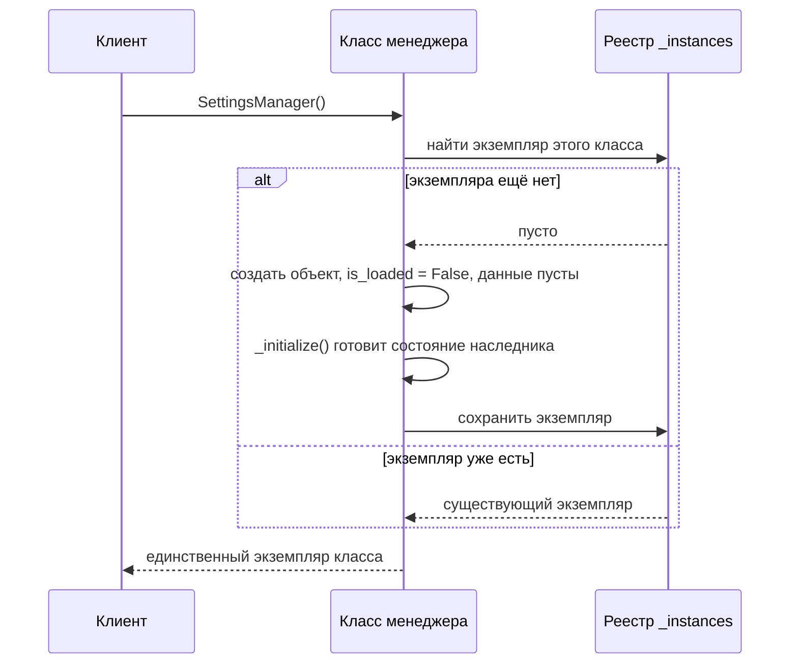
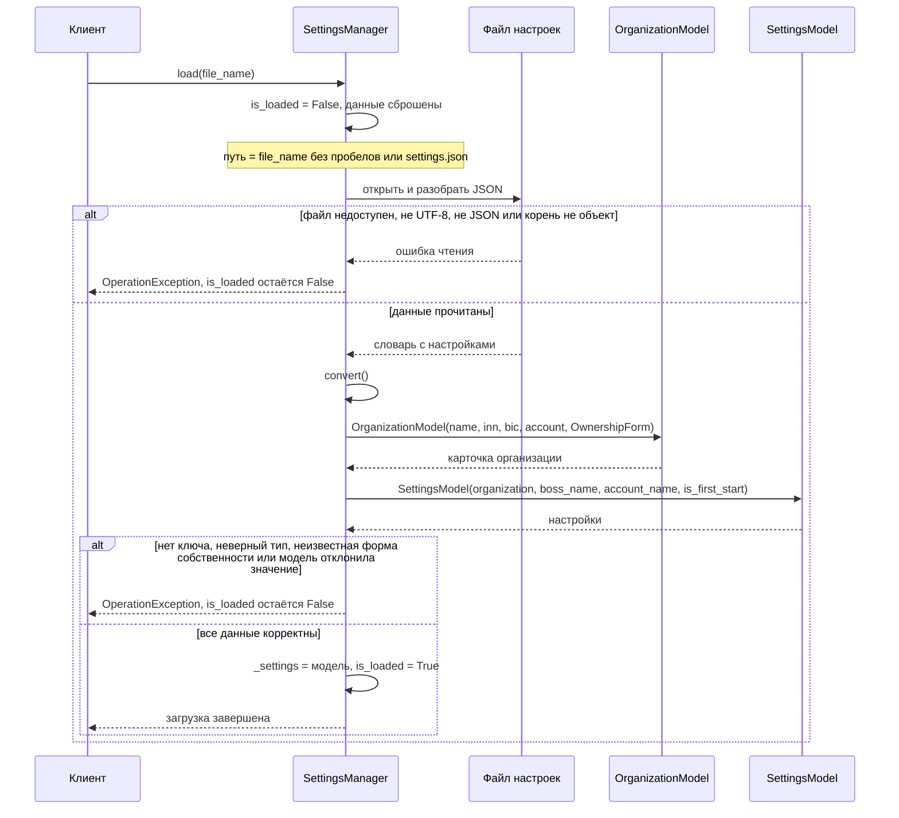
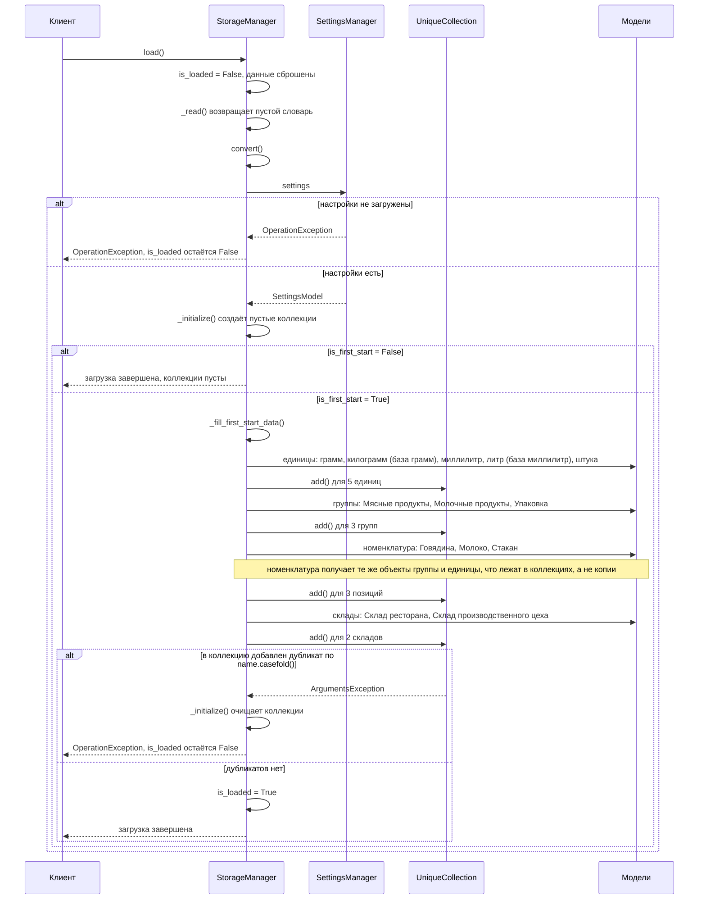

# Диаграммы последовательности

Диаграммы описывают, как работает реализованный код в `Src/`: порядок вызовов и ветки ошибок.
Классы и связи между ними — в [`ClassDiagram.md`](ClassDiagram.md).
При изменении порядка вызовов в менеджерах обновляйте соответствующую диаграмму.

## Получение экземпляра менеджера (Singleton)

Одинаково для любого менеджера: `SettingsManager()` и `StorageManager()` возвращают один и тот же объект.
Состояние готовится в `AbstractManager.__new__`, а не в конструкторе: конструктор Python вызывает
при каждом обращении к классу, а состояние нужно создать ровно один раз.

Если `_initialize()` упадёт, экземпляр в реестр не попадает: полусозданного менеджера не остаётся.

## Загрузка настроек: SettingsManager.load()

Общий порядок задаёт `AbstractManager.load()`: сначала `_read()`, затем `convert()`.
Флаг `is_loaded` становится `True` только после успешного `convert()`. Пока он `False`, свойство
`settings` бросает `OperationException`, даже если раньше настройки уже загружались.

Если в файле нет `is_first_start`, флаг принимается равным `True`.
Модель присваивается только целиком: при ошибке прежние настройки не затираются наполовину собранными.

## Загрузка хранилища и первый старт: StorageManager.load()

`StorageManager` зависит от настроек: флаг `is_first_start` он читает в `convert()` через `SettingsManager`.
Поэтому `SettingsManager.load()` нужно вызвать до `StorageManager.load()`. Внешнего источника данных пока нет:
`_read()` возвращает пустой словарь, чтение из SQLite появится позже.

Повторный `load()` каждый раз пересоздаёт коллекции, поэтому данные не дублируются. Если после первого
запуска в настройках сброшен `is_first_start`, повторная загрузка оставит коллекции пустыми.
